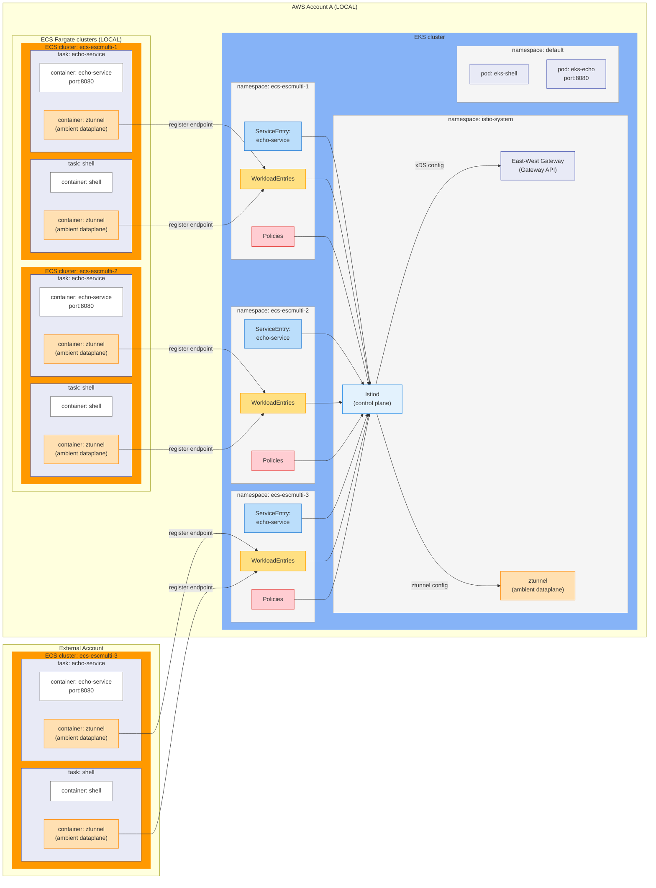

# Scenario 3: Cross-Account (3 ECS Clusters, 2 AWS Accounts)

This guide walks you through deploying **Istio Ambient service mesh** across multiple AWS accounts with three ECS clusters. This is the full multi-account setup demonstrating cross-account service discovery and communication.

## What You'll Deploy

```
┌─────────────────────────────────────────────────────────┐
│                    ISTIO CONTROL PLANE                  │
│                      (in EKS cluster)                   │
│                                                         │
│  ┌──────────┐  ┌──────────┐  ┌────────────────┐         │
│  │  Istiod  │  │ Ztunnel  │  │  East-West GW  │         │
│  │          │  │  (CNI)   │  │   (HBONE)      │         │
│  └──────────┘  └──────────┘  └────────────────┘         │
│       │                              │                  │
│       │ Service Discovery            │ Secure tunnel    │
│       │ Policy Enforcement           │ mTLS (HBONE)     │
│       │                              │                  │
└───────┼──────────────────────────────┼──────────────────┘
        │                              │
        ├──────────┬───────────────────┼───────────────────┐
        │          │                   │                   │
        ▼          ▼                   ▼                   │
   ┌─────────┐ ┌─────────┐       ┌─────────┐              │
   │ Cluster │ │ Cluster │       │ Cluster │   VPC Peering │
   │    1    │ │    2    │       │    3    │◄─────────────┘
   │ (local) │ │ (local) │       │(external)│
   └─────────┘ └─────────┘       └─────────┘
     ecs.local   ecs.local        ecs.external
```

## Architecture



**Services per Cluster:**
- Local clusters: `*.ecs-{CLUSTER_NAME}-{1,2}.ecs.local`
- External cluster: `*.ecs-{CLUSTER_NAME}-3.ecs.external`

---

## Prerequisites

- AWS CLI configured with **two profiles** (local + external account)
- kubectl with access to your EKS cluster (or eksctl to create one)
- istioctl with ECS support from Solo.io
- jq
- Gloo Mesh license key
- Administrative access to both AWS accounts

---

## Step 0: Environment Setup

### 0.1 Create Configuration File

```bash
cat << 'EOF' > env-config.sh
# Scenario Selection
export SCENARIO=3

# AWS Account Information
export LOCAL_ACCOUNT=<your_local_account_id>        # e.g., 123456789012
export EXTERNAL_ACCOUNT=<your_external_account_id>  # e.g., 987654321098
export LOCAL_ACCOUNT_PROFILE=<local_profile>        # e.g., default
export EXTERNAL_ACCOUNT_PROFILE=<external_profile>  # e.g., external-profile
export INT=$LOCAL_ACCOUNT_PROFILE
export EXT=$EXTERNAL_ACCOUNT_PROFILE

# AWS Region and Cluster Configuration
export AWS_REGION=us-east-2
export CLUSTER_NAME=istio-ecs-demo
export OWNER_NAME=$(whoami)

# EKS Configuration
export NUMBER_NODES=2
export NODE_TYPE=t2.medium

# Istio Configuration
export HUB=us-docker.pkg.dev/gloo-mesh/istio-594e990587b9
export ISTIO_TAG=1.28.1-solo
export GLOO_MESH_LICENSE_KEY=<your-license-key>
EOF
```

### 0.2 Login to AWS (Both Accounts)

```bash
source env-config.sh
aws sso login --profile $LOCAL_ACCOUNT_PROFILE
aws sso login --profile $EXTERNAL_ACCOUNT_PROFILE
```

---

## Part 1: Infrastructure Setup

This section creates all required AWS infrastructure including VPC peering between accounts.

### Step 1.1: Create the EKS Cluster (Local Account)

```bash
export AWS_PROFILE=$INT
eval "echo \"$(cat manifests/eks-cluster.yaml)\"" | eksctl create cluster --config-file -
```

### Step 1.2: Deploy Gateway API CRDs

```bash
kubectl apply -f https://github.com/kubernetes-sigs/gateway-api/releases/download/v1.4.0/standard-install.yaml
```

### Step 1.3: Setup External VPC and Cross-Account Infrastructure

Run the automated setup script:

```bash
./scripts/setup-infrastructure.sh
```

**What Gets Created:**

**In the External Account:**
- VPC with public and private subnets across 3 availability zones
- Internet Gateway and NAT Gateway
- Route tables for public and private traffic
- Security groups with proper ingress rules

**Cross-Account:**
- VPC peering connection between local and external accounts
- Peering routes in all route tables
- Security group rules for cross-account traffic

**IAM Roles:**
- `istiod-role` - Main role for Istiod with EKS Pod Identity
- `istiod-local` - Role for accessing local account ECS resources
- `istiod-external` - Role for accessing external account ECS resources

### Step 1.4: Create IAM Roles for ECS Tasks

```bash
./scripts/create-iam-roles.sh
```

**Re-source your config** to load all generated variables:

```bash
source env-config.sh
```

Verify the roles are set:
```bash
echo "LOCAL_ROLE: $LOCAL_ROLE"
echo "EXTERNAL_ROLE: $EXTERNAL_ROLE"
# Both should show ARNs like: arn:aws:iam::<account>:role/istiod-*
```

---

## Part 2: Service Mesh Deployment

### Step 2.1: Download istioctl

Contact Solo.io for the download link, then:

```bash
wget <your-download-link>
tar xvzf istio-*.tar.gz --strip-components=2 istio-*/bin/istioctl
rm istio-*.tar.gz
chmod +x istioctl
```

### Step 2.2: Install Istio in Ambient Mode

```bash
source env-config.sh

cat <<EOF | ./istioctl install -y -f -
apiVersion: install.istio.io/v1alpha1
kind: IstioOperator
spec:
  profile: ambient
  meshConfig:
    accessLogFile: /dev/stdout
  values:
    global:
      hub: ${HUB}
      tag: ${ISTIO_TAG}
      network: eks
    license:
      value: ${GLOO_MESH_LICENSE_KEY}
    cni:
      ambient:
        dnsCapture: true
    platforms:
      ecs:
        accounts:
          - role: ${LOCAL_ROLE}
            domain: ecs.local
          - role: ${EXTERNAL_ROLE}
            domain: ecs.external
    pilot:
      env:
        PILOT_ENABLE_IP_AUTOALLOCATE: "true"
        PILOT_ENABLE_ALPHA_GATEWAY_API: "true"
        REQUIRE_3P_TOKEN: "false"
EOF
```

**Key Difference from Scenarios 1 & 2:** Two account roles are configured - one for local ECS clusters (`ecs.local`) and one for external account (`ecs.external`).

### Step 2.3: Deploy East-West Gateway

```bash
kubectl apply -f - <<EOF
apiVersion: gateway.networking.k8s.io/v1
kind: Gateway
metadata:
  labels:
    istio.io/expose-istiod: "15012"
    topology.istio.io/network: eks
  name: eastwest
  namespace: istio-system
spec:
  gatewayClassName: istio-eastwest
  listeners:
  - name: cross-network
    port: 15008
    protocol: HBONE
    tls:
      mode: Passthrough
  - name: xds-tls
    port: 15012
    protocol: TLS
    tls:
      mode: Passthrough
EOF
```

### Step 2.4: Label Network

```bash
kubectl label namespace istio-system topology.istio.io/network=eks
```

### Step 2.5: Verify Istio Installation

```bash
kubectl get pods -n istio-system
```

---

## Part 3: Deploy ECS Workloads

### Step 3.1: Deploy ECS Clusters and Services

```bash
./scripts/deploy-ecs-clusters.sh
```

This deploys:
- `ecs-{CLUSTER_NAME}-1` (local account)
- `ecs-{CLUSTER_NAME}-2` (local account)
- `ecs-{CLUSTER_NAME}-3` (external account)

Each with `shell-task` and `echo-service`.

**Note:** If this script runs into errors, wait 20-30 minutes and retry. IAM resources need time to propagate.

### Step 3.2: Create Kubernetes Namespaces

```bash
./scripts/create-k8s-namespaces.sh
```

### Step 3.3: Add Services to Mesh

```bash
./scripts/add-services-to-mesh.sh
```

---

## Part 4: Verify Service Discovery

### Check All Services are Discovered

```bash
./istioctl ztunnel-config services | grep $CLUSTER_NAME
```

Expected (6 services - 2 per cluster):
```
NAMESPACE               SERVICE NAME                               SERVICE VIP
ecs-{CLUSTER_NAME}-1   ecs-service-...-echo-service   240.240.0.2
ecs-{CLUSTER_NAME}-1   ecs-service-...-shell-task     240.240.0.4
ecs-{CLUSTER_NAME}-2   ecs-service-...-echo-service   240.240.0.6
ecs-{CLUSTER_NAME}-2   ecs-service-...-shell-task     240.240.0.5
ecs-{CLUSTER_NAME}-3   ecs-service-...-echo-service   240.240.0.3
ecs-{CLUSTER_NAME}-3   ecs-service-...-shell-task     240.240.0.1
```

### Check Workloads are Using HBONE

```bash
./istioctl ztunnel-config workloads | grep -E "$CLUSTER_NAME" | awk '{ print $2 "\t" $3 "\t" $5; }'
```

**If you see HBONE protocol, your services are enrolled with automatic mTLS!**

### Check Service Entries

```bash
kubectl get serviceentry -A
```

Expected: 6 ServiceEntry objects with hosts:
- `echo-service.ecs-{CLUSTER_NAME}-1.ecs.local`
- `shell-task.ecs-{CLUSTER_NAME}-1.ecs.local`
- `echo-service.ecs-{CLUSTER_NAME}-2.ecs.local`
- `shell-task.ecs-{CLUSTER_NAME}-2.ecs.local`
- `echo-service.ecs-{CLUSTER_NAME}-3.ecs.external`
- `shell-task.ecs-{CLUSTER_NAME}-3.ecs.external`

---

## Part 5: Test Cross-Account Communication

### Deploy Test Pods in EKS

```bash
kubectl label namespace default istio.io/dataplane-mode=ambient
kubectl apply -f manifests/eks-echo.yaml
kubectl apply -f manifests/eks-shell.yaml
```

### Test EKS-to-EKS

```bash
kubectl exec -it $(kubectl get pods -l app=eks-shell -o jsonpath="{.items[0].metadata.name}") -- curl eks-echo:8080
```

### Test EKS-to-Local ECS (Cluster 1)

```bash
kubectl exec -it $(kubectl get pods -l app=eks-shell -o jsonpath="{.items[0].metadata.name}") -- \
  curl echo-service.ecs-${CLUSTER_NAME}-1.ecs.local:8080 | jq
```

### Test EKS-to-Local ECS (Cluster 2)

```bash
kubectl exec -it $(kubectl get pods -l app=eks-shell -o jsonpath="{.items[0].metadata.name}") -- \
  curl echo-service.ecs-${CLUSTER_NAME}-2.ecs.local:8080 | jq '{hostname: .host.hostname, ip: .host.ip}'
```

### Test EKS-to-External ECS (Cluster 3 - Cross-Account!)

```bash
kubectl exec -it $(kubectl get pods -l app=eks-shell -o jsonpath="{.items[0].metadata.name}") -- \
  curl -s echo-service.ecs-${CLUSTER_NAME}-3.ecs.external:8080 | jq '{hostname: .host.hostname, ip: .host.ip}'
```

**Success!** You've just made a cross-account call through the service mesh with automatic mTLS.

### Test ECS-to-ECS

```bash
scripts/test/call-from-ecs.sh echo-service.ecs-${CLUSTER_NAME}-1.ecs.local:8080
```

---

## Part 6: Authorization Policy Workshop

This section walks through Istio L4 authorization policies to control traffic between clusters, including cross-account scenarios.

### Interactive Test Script

Run the interactive test script to explore each policy:

```bash
./scripts/test/test-authz-policies-sc3.sh
```

Or run a specific exercise:

```bash
./scripts/test/test-authz-policies-sc3.sh -e 1    # Baseline (no policies)
./scripts/test/test-authz-policies-sc3.sh -e 2    # Deny-all
./scripts/test/test-authz-policies-sc3.sh -e 3    # Allow EKS
./scripts/test/test-authz-policies-sc3.sh -e 4    # Allow Cluster 2 (same account)
./scripts/test/test-authz-policies-sc3.sh -e 5    # Allow Cluster 3 (external account)
./scripts/test/test-authz-policies-sc3.sh -e 6    # Allow internal
./scripts/test/test-authz-policies-sc3.sh -e 7    # Explicit deny external account
./scripts/test/test-authz-policies-sc3.sh -e all  # Run all exercises
```

---

### Exercise 6.1: Baseline (No Policies)

Verify all connections work without policies. Clear any existing policies:

```bash
kubectl delete authorizationpolicy --all -n ecs-${CLUSTER_NAME}-1
kubectl delete authorizationpolicy --all -n ecs-${CLUSTER_NAME}-2
kubectl delete authorizationpolicy --all -n ecs-${CLUSTER_NAME}-3
```

**Test:**
```bash
./scripts/test/test-authz-policies-sc3.sh -e 1
```

**Expected Output:**
```
[TEST] EKS -> Cluster 1 echo-service
[PASS] Connected successfully
[TEST] EKS -> Cluster 2 echo-service
[PASS] Connected successfully
[TEST] EKS -> Cluster 3 echo-service (external account)
[PASS] Connected successfully
[TEST] Cluster 2 -> Cluster 1 echo-service
[PASS] Connected successfully
[TEST] Cluster 3 -> Cluster 1 echo-service (cross-account)
[PASS] Connected successfully
[TEST] Cluster 1 internal (shell -> echo)
[PASS] Connected successfully
```

---

### Exercise 6.2: Deny-All Policy

Block all traffic to Cluster 1:

```yaml
apiVersion: security.istio.io/v1
kind: AuthorizationPolicy
metadata:
  name: deny-all
  namespace: ecs-${CLUSTER_NAME}-1
spec:
  {}
```

Apply and test:
```bash
./scripts/test/test-authz-policies-sc3.sh -e 2
```

**Expected Output:**
```
[TEST] EKS -> Cluster 1 echo-service
[FAIL] Connection failed: curl: (56) Recv failure: Connection reset
[TEST] EKS -> Cluster 2 echo-service
[PASS] Connected successfully
[TEST] EKS -> Cluster 3 echo-service (external account)
[PASS] Connected successfully
[TEST] Cluster 2 -> Cluster 1 echo-service
[FAIL] Connection failed: curl: (56) Recv failure: Connection reset
[TEST] Cluster 3 -> Cluster 1 echo-service (cross-account)
[FAIL] Connection failed: curl: (56) Recv failure: Connection reset
[TEST] Cluster 1 internal (shell -> echo)
[FAIL] Connection failed: curl: (56) Recv failure: Connection reset
```

**Effect:** All inbound traffic to Cluster 1 is blocked. Clusters 2 and 3 remain accessible.

---

### Exercise 6.3: Allow EKS to Cluster 1

Allow only EKS (namespace `default`) to reach Cluster 1. This policy is added alongside the deny-all:

```yaml
apiVersion: security.istio.io/v1
kind: AuthorizationPolicy
metadata:
  name: allow-eks-to-echo
  namespace: ecs-${CLUSTER_NAME}-1
spec:
  action: ALLOW
  rules:
  - from:
    - source:
        namespaces: ["default"]
    to:
    - operation:
        ports: ["8080"]
```

Apply and test:
```bash
./scripts/test/test-authz-policies-sc3.sh -e 3
```

**Expected Output:**
```
[TEST] EKS -> Cluster 1 echo-service
[PASS] Connected successfully
[TEST] Cluster 2 -> Cluster 1 echo-service
[FAIL] Connection failed: curl: (56) Recv failure: Connection reset
[TEST] Cluster 3 -> Cluster 1 echo-service (cross-account)
[FAIL] Connection failed: curl: (56) Recv failure: Connection reset
[TEST] Cluster 1 internal (shell -> echo)
[FAIL] Connection failed: curl: (56) Recv failure: Connection reset
```

**Effect:** EKS can reach Cluster 1, but both ECS clusters (same account and external) are still blocked.

---

### Exercise 6.4: Allow Cluster 2 to Cluster 1 (Same Account)

Enable communication from Cluster 2 (same AWS account):

```yaml
apiVersion: security.istio.io/v1
kind: AuthorizationPolicy
metadata:
  name: allow-cluster-2-to-echo
  namespace: ecs-${CLUSTER_NAME}-1
spec:
  action: ALLOW
  rules:
  - from:
    - source:
        namespaces: ["ecs-${CLUSTER_NAME}-2"]
    to:
    - operation:
        ports: ["8080"]
```

Apply and test:
```bash
./scripts/test/test-authz-policies-sc3.sh -e 4
```

**Expected Output:**
```
[TEST] EKS -> Cluster 1 echo-service
[PASS] Connected successfully
[TEST] Cluster 2 -> Cluster 1 echo-service
[PASS] Connected successfully
[TEST] Cluster 3 -> Cluster 1 echo-service (cross-account)
[FAIL] Connection failed: curl: (56) Recv failure: Connection reset
[TEST] Cluster 1 internal (shell -> echo)
[FAIL] Connection failed: curl: (56) Recv failure: Connection reset
```

**Effect:** EKS and Cluster 2 can reach Cluster 1. External account (Cluster 3) is still blocked.

---

### Exercise 6.5: Allow Cluster 3 to Cluster 1 (Cross-Account)

Enable communication from Cluster 3 (external AWS account):

```yaml
apiVersion: security.istio.io/v1
kind: AuthorizationPolicy
metadata:
  name: allow-cluster-3-to-echo
  namespace: ecs-${CLUSTER_NAME}-1
spec:
  action: ALLOW
  rules:
  - from:
    - source:
        namespaces: ["ecs-${CLUSTER_NAME}-3"]
    to:
    - operation:
        ports: ["8080"]
```

Apply and test:
```bash
./scripts/test/test-authz-policies-sc3.sh -e 5
```

**Expected Output:**
```
[TEST] EKS -> Cluster 1 echo-service
[PASS] Connected successfully
[TEST] Cluster 2 -> Cluster 1 echo-service
[PASS] Connected successfully
[TEST] Cluster 3 -> Cluster 1 echo-service (cross-account)
[PASS] Connected successfully
[TEST] Cluster 1 internal (shell -> echo)
[FAIL] Connection failed: curl: (56) Recv failure: Connection reset
```

**Effect:** All external sources (EKS, Cluster 2, Cluster 3) can reach Cluster 1. Internal traffic is still blocked.

---

### Exercise 6.6: Allow Internal Communication

Allow services within Cluster 1 to communicate:

```yaml
apiVersion: security.istio.io/v1
kind: AuthorizationPolicy
metadata:
  name: allow-internal
  namespace: ecs-${CLUSTER_NAME}-1
spec:
  action: ALLOW
  rules:
  - from:
    - source:
        namespaces: ["ecs-${CLUSTER_NAME}-1"]
    to:
    - operation:
        ports: ["8080"]
```

Apply and test:
```bash
./scripts/test/test-authz-policies-sc3.sh -e 6
```

**Expected Output:**
```
[TEST] EKS -> Cluster 1 echo-service
[PASS] Connected successfully
[TEST] Cluster 2 -> Cluster 1 echo-service
[PASS] Connected successfully
[TEST] Cluster 3 -> Cluster 1 echo-service (cross-account)
[PASS] Connected successfully
[TEST] Cluster 1 internal (shell -> echo)
[PASS] Connected successfully
```

**Effect:** All traffic paths are now allowed through the combination of ALLOW policies.

---

### Exercise 6.7: Explicit Deny External Account

This exercise resets policies and demonstrates blocking external account traffic while allowing same-account access.
The script clears all policies and applies: deny-all + allow-eks-to-echo + allow-cluster-2-to-echo + deny-external.

```yaml
apiVersion: security.istio.io/v1
kind: AuthorizationPolicy
metadata:
  name: deny-external-account
  namespace: ecs-${CLUSTER_NAME}-1
spec:
  action: DENY
  rules:
  - from:
    - source:
        namespaces: ["ecs-${CLUSTER_NAME}-3"]
```

Apply and test:
```bash
./scripts/test/test-authz-policies-sc3.sh -e 7
```

**Expected Output:**
```
[TEST] EKS -> Cluster 1 echo-service
[PASS] Connected successfully
[TEST] Cluster 2 -> Cluster 1 echo-service
[PASS] Connected successfully
[TEST] Cluster 3 -> Cluster 1 echo-service (cross-account)
[FAIL] Connection failed: curl: (56) Recv failure: Connection reset
[TEST] Cluster 1 internal (shell -> echo)
[FAIL] Connection failed: curl: (56) Recv failure: Connection reset
```

**Effect:** Traffic from external AWS account (Cluster 3) is explicitly denied. This demonstrates how to isolate cross-account traffic while allowing same-account communication.

---

### Cleanup Policies

Remove all authorization policies:

```bash
./scripts/test/test-authz-policies-sc3.sh --cleanup
```

Or manually:

```bash
kubectl delete authorizationpolicy --all -n ecs-${CLUSTER_NAME}-1
kubectl delete authorizationpolicy --all -n ecs-${CLUSTER_NAME}-2
kubectl delete authorizationpolicy --all -n ecs-${CLUSTER_NAME}-3
```

---

### Key Concepts

| Concept | Description |
|---------|-------------|
| Empty `spec: {}` | Implicit deny-all (blocks everything) |
| `action: ALLOW` | Opens specific paths through deny-all |
| `action: DENY` | Evaluated before ALLOW rules |
| `source.namespaces` | Identity from mTLS certificates |
| `operation.ports` | L4 port filtering |
| Cross-account | Same policies work across AWS account boundaries |

**Key Learning:** Authorization policies work seamlessly across AWS account boundaries. The mesh identity (namespace) is the same whether the workload runs in the local or external account.

---

## Part 7: Observability

### View Traffic Patterns

```bash
kubectl logs -n istio-system -l app=ztunnel --tail=50
```

### View Service Mesh Topology

```bash
./istioctl ztunnel-config services
./istioctl ztunnel-config workloads
```

### Verify mTLS Status

```bash
./istioctl proxy-config secret -n istio-system deployment/ztunnel
```

---

## Cleanup

### Run Automated Cleanup

```bash
./scripts/cleanup.sh
```

This will:
1. Remove Istio resources (policies, waypoints, services from mesh)
2. Delete ECS resources (services, clusters, task definitions)
3. Remove IAM resources (roles and policies in both accounts)
4. Delete infrastructure (VPC peering, external VPC, NAT gateway)

### Delete EKS Cluster

```bash
export AWS_PROFILE=$INT
eksctl delete cluster -n ${CLUSTER_NAME}
```

---

## Summary

You've successfully deployed:
- Istio Ambient service mesh managing services across 2 AWS accounts
- 3 ECS clusters with automatic cross-account service discovery
- Zero-trust mTLS encryption across VPC boundaries
- L4 and L7 authorization policies

**Key Achievements:**
- Cross-account VPC peering with proper routing
- IAM roles for cross-account Istio discovery
- Unified service mesh spanning organizational boundaries
- Seamless cross-account communication with automatic mTLS

---

## Troubleshooting

### Services Not Discovered?

```bash
kubectl logs -n istio-system deploy/istiod | grep ecs
# Should see: "configured ecs accounts" with both account roles

# Restart istiod to re-discover
kubectl rollout restart deployment/istiod -n istio-system
```

### Cross-Account Connectivity Issues?

```bash
# Verify VPC peering
aws ec2 describe-vpc-peering-connections \
    --vpc-peering-connection-ids $PEERING_ID \
    --profile $LOCAL_ACCOUNT_PROFILE

# Check security group rules
aws ec2 describe-security-groups \
    --group-ids $EXTERNAL_SG \
    --profile $EXTERNAL_ACCOUNT_PROFILE

# Verify IAM roles
aws iam get-role --role-name istiod-role --profile $LOCAL_ACCOUNT_PROFILE
```

### External Account Tasks Not Starting?

```bash
# Check ECS cluster exists
aws ecs describe-clusters --clusters ecs-${CLUSTER_NAME}-3 --profile $EXTERNAL_ACCOUNT_PROFILE

# Check task definition
aws ecs describe-task-definition --task-definition echo-service-definition --profile $EXTERNAL_ACCOUNT_PROFILE

# Check CloudWatch logs
aws logs tail /ecs/ecs-demo --profile $EXTERNAL_ACCOUNT_PROFILE
```

### Traffic Not Encrypted?

```bash
./istioctl ztunnel-config workloads | grep -i hbone
# If showing TCP instead of HBONE:
# - Service not added to mesh
# - Namespace not labeled for ambient
# - Task needs redeployment
```

---

## Architecture Patterns

### Multi-Account Benefits

1. **Organizational Boundaries** - Different teams, different accounts
2. **Cost Allocation** - Clear AWS billing separation
3. **Security Isolation** - Account-level separation + mesh security
4. **Compliance** - Meet regulatory requirements

### Before vs After

**Before** (without service mesh):
- Manual TLS certificate management
- Application-level authentication
- Network policies scattered across AWS
- No visibility into service communication
- Complex cross-account setup

**After** (with Istio Ambient):
- Automatic mTLS (zero-trust by default)
- Centralized policy management
- Service discovery across accounts/clusters
- Rich observability (logs, metrics, traces)
- Simple cross-account communication
